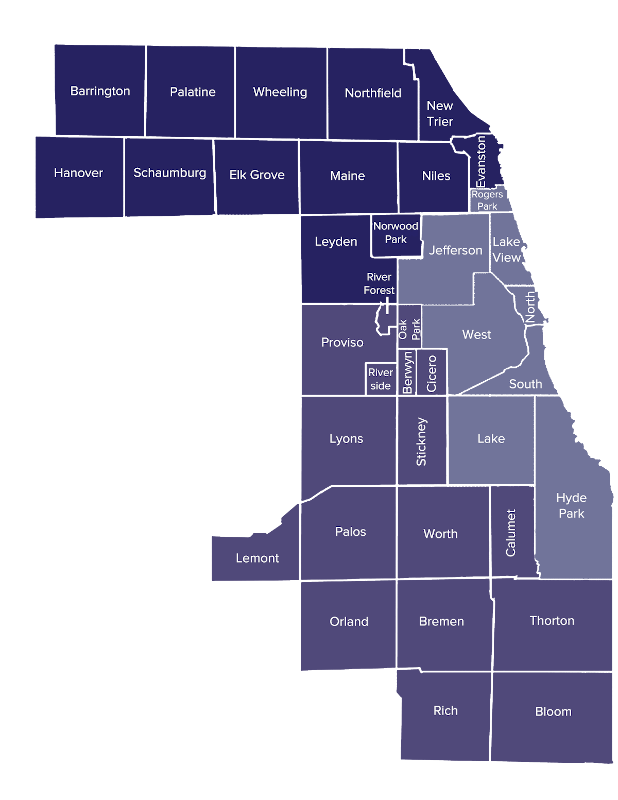
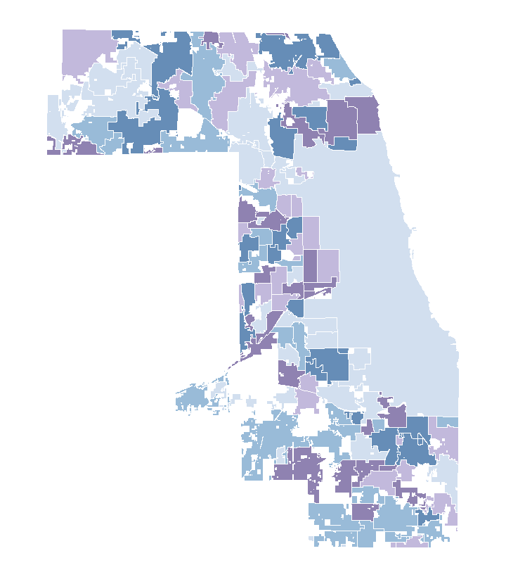
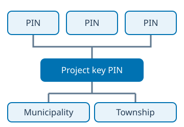
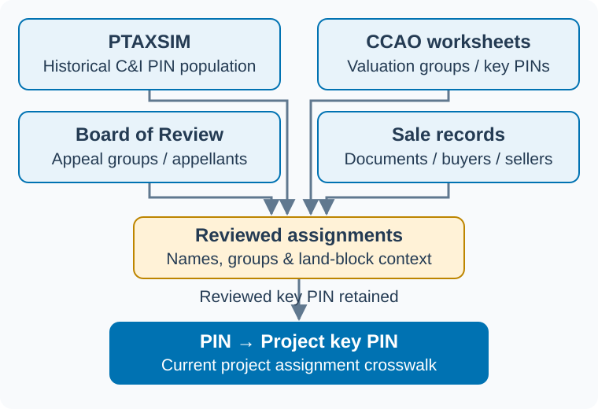
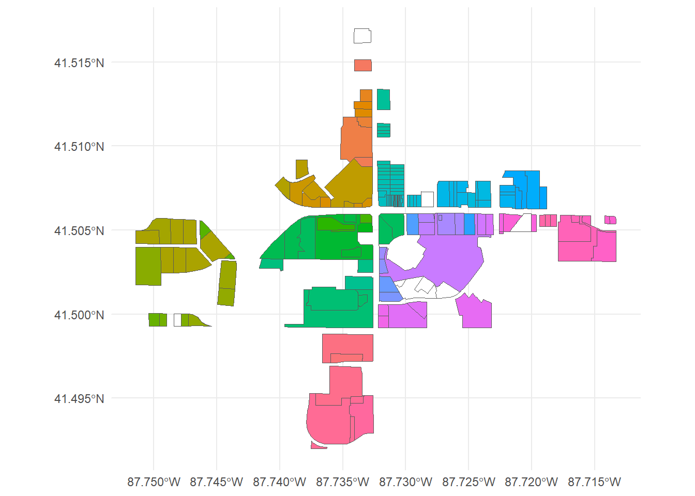
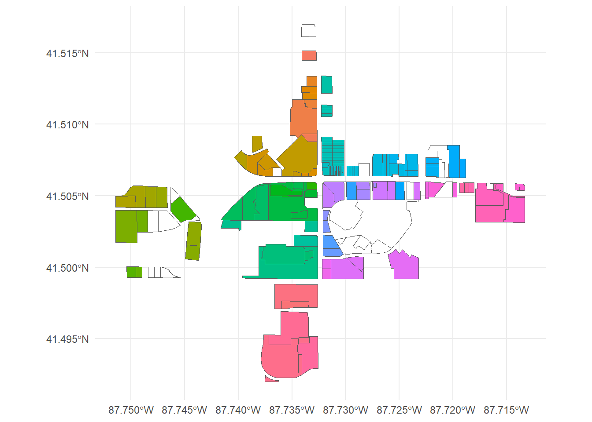
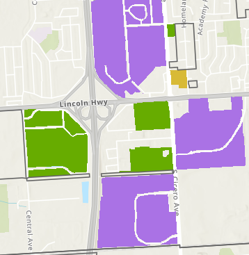
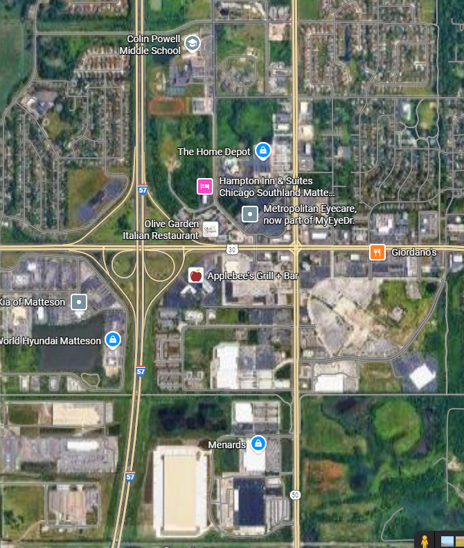

This website documents how individual Property Index Numbers (PINs) were grouped into larger commercial and industrial property projects.

::: {.grid .index-cards}

::: {.g-col-12 .g-col-md-6}
### Browse by Township

{.card-image fig-alt="Map of Cook County townships"}

Search for a township and open the township report containing its commercial and industrial PINs.

[Browse townships](townships.qmd)
:::

::: {.g-col-12 .g-col-md-6}
### Browse by municipality

{.card-image fig-alt="Map of municipal boundaries in Cook County"}

Search for a municipality and open the township report or reports containing its commercial and industrial PINs.

[Browse municipalities](municipalities.qmd)
:::

::: {.g-col-12 .g-col-md-6}
### Find a PIN or Project

{.card-image fig-alt="Diagram showing PIN records linked to a project key PIN and regional summaries"}

Search for a PIN, municipality, township, project key PIN, or appellant.

[Search PINs](pins.qmd)
:::

::: {.g-col-12 .g-col-md-6}
### How the data are organized

Read how PINs, key PINs, projects, municipalities, and townships relate to one another.

[{.source-diagram fig-alt="PTAXSIM PIN population, CCAO valuation worksheets, Board of Review appeals, and sales records connect to reviewed assignments and the PIN-to-project-key-PIN crosswalk. Current identifiers come from reviewed assignments."}](images/project-identifier-sources.svg)

[Read the documentation](about.qmd)
:::

:::
## Examaple: Different ways to define a project

These four views of Matteson near I-57 and Lincoln Highway illustrate how manually coded projects, assessor valuation worksheets, and CMAP developments group properties differently. None of them are wrong, but they are different. They also are snapshots from different points in time. 

::: {.comparison-grid}

::: {.comparison-item}

:::

::: {.comparison-item}

Matteson is located in Rich Township. KeyPINs were from the 2023 Reassessment of the South Triad. 
:::

::: {.comparison-item}

See CMAP's [Development Database](https://cmap.illinois.gov/data/land-use/development-database/) for another great resource on developments in Cook, DuPage, Kane, Kendall, Lake, McHenry, and Will County.
:::

::: {.comparison-item}

:::

:::
